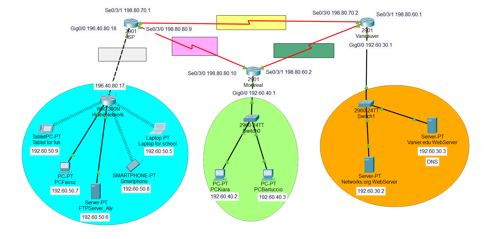

# Packet Tracer Network Design

A Cisco Packet Tracer project that designs, configures, and tests a multi-site network with wired and wireless clients, dynamic routing, FTP, DNS, and web services.

## Project Overview

The topology connects three routed areas through ISP, Montreal, and Vancouver routers:

- A home network with a wireless router, laptop, tablet, smartphone, desktop computer, and FTP server
- A Montreal LAN with two desktop computers
- A Vancouver server network hosting DNS and two websites

The project was completed for Networks (420-421-VA) by Kiara Bartuccio and Fairoz Aly.

## Network Addressing

| Segment | Addressing shown in the project | Purpose |
| --- | --- | --- |
| Home WAN | `196.40.80.16/30` | Connection between the ISP and home wireless router |
| Home LAN | `192.60.50.0` | Wireless devices, desktop computer, and FTP server |
| Montreal LAN | `192.60.40.0/26` | Kiara and Fairoz desktop computers |
| Vancouver LAN | `192.60.30.0` | DNS and web servers |
| Router links | `198.80.70.x`, `198.80.80.x`, and `198.80.60.x` | Connections among the ISP, Montreal, and Vancouver routers |

## Configuration Work

### Wireless Network

- Configured the home router's WAN and LAN interfaces
- Enabled DHCP for wireless clients
- Connected the laptop, tablet, and smartphone to the SSID
- Secured the wireless network with WPA2 Personal and AES encryption

### Devices and Services

- Assigned static IP addresses, masks, gateways, and DNS settings where required
- Enabled FTP and created users with read and write permissions
- Configured DNS records for `vanier.edu` and `networks.org`
- Enabled HTTP and customized both server websites
- Used RIP dynamic routing so every network could reach the others

## Testing

The team used several tests to confirm that the network worked:

- Sent pings and Packet Tracer PDUs between devices on different networks
- Uploaded a file to the FTP server from one device and downloaded it from another
- Edited the shared file to verify that changes were accessible
- Opened both hosted websites from devices on the other networks

## Troubleshooting

During the web access test, clients could not reach the websites even though the addressing and server settings appeared correct. The problem came from cables on the yellow router segment being connected to the wrong ports. Correcting those connections restored the routing path and made the web servers reachable.

## Quick Start

HOW I RUN: OPEN FILE ON INSTALLED PACKET TRACER

1. Install [Cisco Packet Tracer](https://www.netacad.com/cisco-packet-tracer).
2. Download or clone this repository.
3. Launch the project:
   - **Windows:** double-click `open-network.bat`
   - **macOS/Linux:** run `chmod +x open-network.sh && ./open-network.sh`
4. Inspect the topology and use **Simulation Mode** to follow packet flow.

You can also open [`network-design.pkt`](network-design.pkt) directly in Packet Tracer.

## Skills Demonstrated

- IPv4 addressing and subnetting
- Wired and wireless network configuration
- DHCP, DNS, FTP, and HTTP services
- WPA2 wireless authentication
- RIP dynamic routing
- End-to-end connectivity testing
- Packet Tracer PDU simulation
- Systematic network troubleshooting

## What I Practiced

This project strengthened my understanding of subnet planning, router and endpoint configuration, network services, dynamic routing, connectivity testing, and diagnosing physical-layer problems that affect higher-level services.
